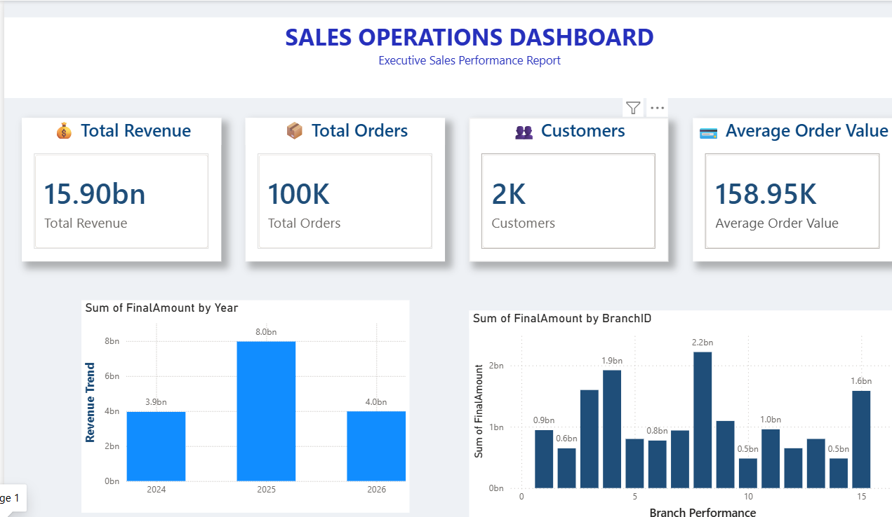
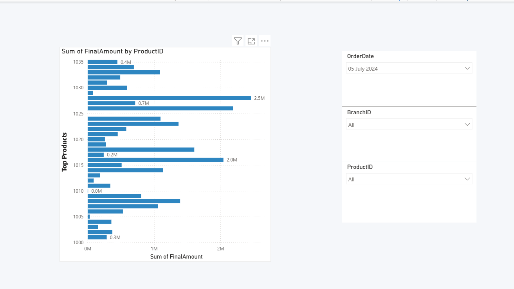
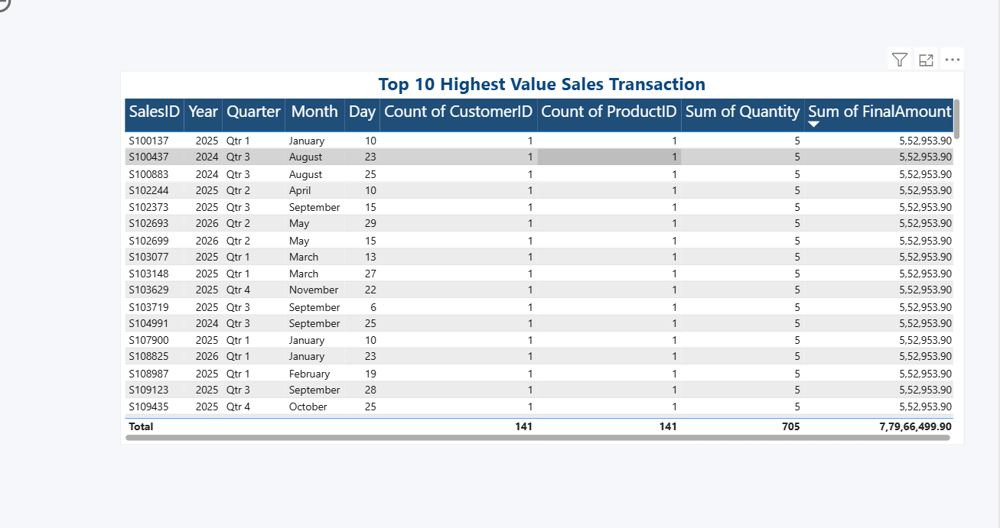

# 📊 Sales Operations MIS Automation

An end-to-end Sales Operations & MIS Automation project built using **Python, SQLite, SQL, Excel, and Power BI**. This project demonstrates the complete data pipeline from synthetic data generation to interactive business dashboards.

---

## 🚀 Project Overview

This project simulates a real-world sales environment by generating synthetic datasets, storing them in SQLite, querying them using SQL, and visualizing key business metrics in Power BI.

---

## 🛠️ Tech Stack

- Python
- Pandas
- Faker
- SQLite
- SQL
- Power BI
- Excel
- Git & GitHub

---

## 📂 Project Structure

```text
Sales-Operations-MIS-Automation/
│
├── Data/
│   ├── branches.csv
│   ├── customers.csv
│   ├── employees.csv
│   ├── products.csv
│   ├── sales.csv
│   └── sales_export.csv
│
├── SQL/
│   ├── sales_database.db
│   └── queries.sql
│
├── Scripts/
│   └── data_generator/
│       ├── config.py
│       ├── generate_branches.py
│       ├── generate_customers.py
│       ├── generate_employees.py
│       ├── generate_products.py
│       ├── generate_sales.py
│       ├── load_to_sql.py
│       ├── export_to_csv.py
│       └── sql_queries.py
│
├── PowerBI/
│   └── Sales_Operations_MIS_Dashboard.pbix
│
├── Images/
│   ├── dashboard.png
│   └── dashboard_page2.png
│
├── README.md
├── requirements.txt
└── .gitignore
```

---

## 📈 Dashboard KPIs

- 💰 Total Revenue
- 📦 Total Orders
- 👥 Total Customers
- 💳 Average Order Value

---

## 📊 Dashboard Visualizations

- Revenue Trend
- Branch Performance
- Top Products
- Top Transactions
- Interactive Filters (Date, Branch, Product)

---

## 🔄 Workflow

1. Generate synthetic sales data using Python.
2. Save data as CSV files.
3. Load data into SQLite.
4. Run SQL queries for business insights.
5. Export processed data to CSV.
6. Build an interactive Power BI dashboard.

---

## 📸 Dashboard Preview

> Add your dashboard screenshots inside the **Images** folder and update the paths below.

### Dashboard - Page 1



### Dashboard - Page 2



### Dashboard - Page 3




---

## 🎯 Skills Demonstrated

- Data Generation
- Data Cleaning
- ETL Process
- SQL Querying
- Business Intelligence
- Dashboard Design
- Data Visualization
- MIS Reporting

---

## 👩‍💻 Author

**Lakshmi Karra**

LinkedIn: *(https://www.linkedin.com/in/lakshmi-karra-5b5153287)*


---

## ⭐ If you found this project useful, please consider giving it a star!
